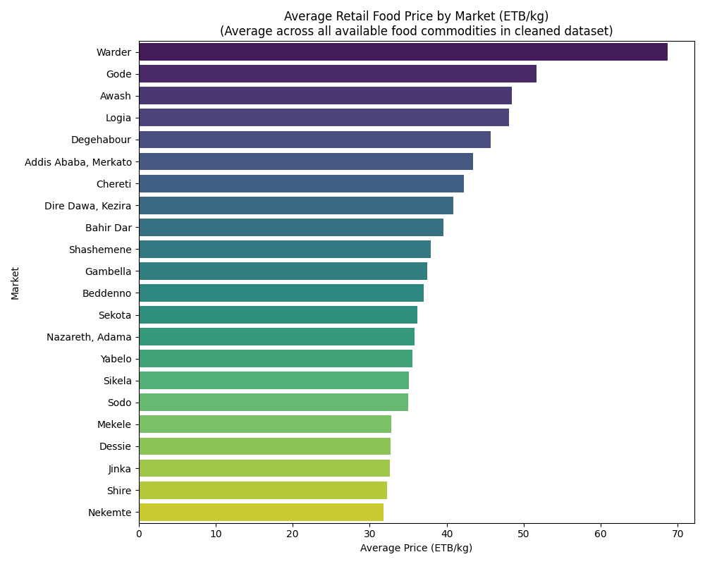
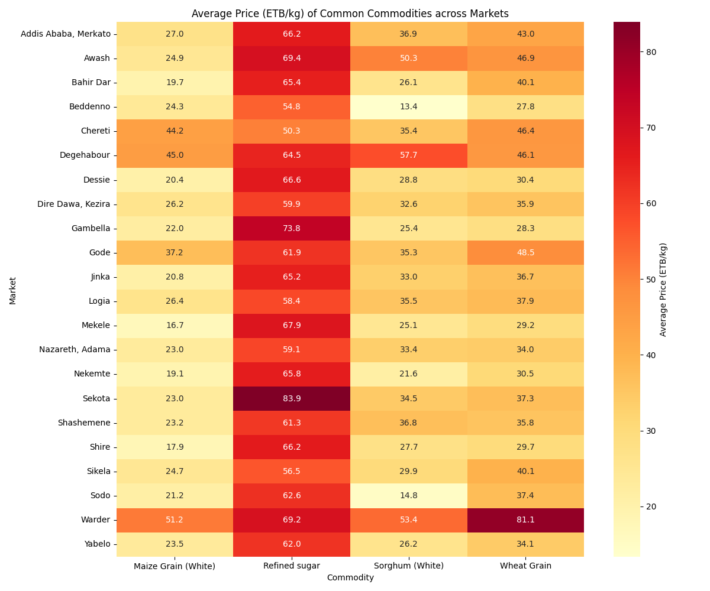
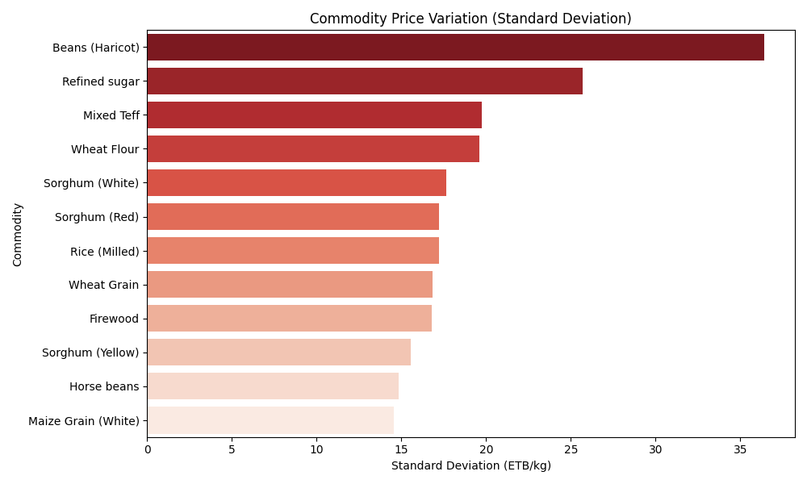
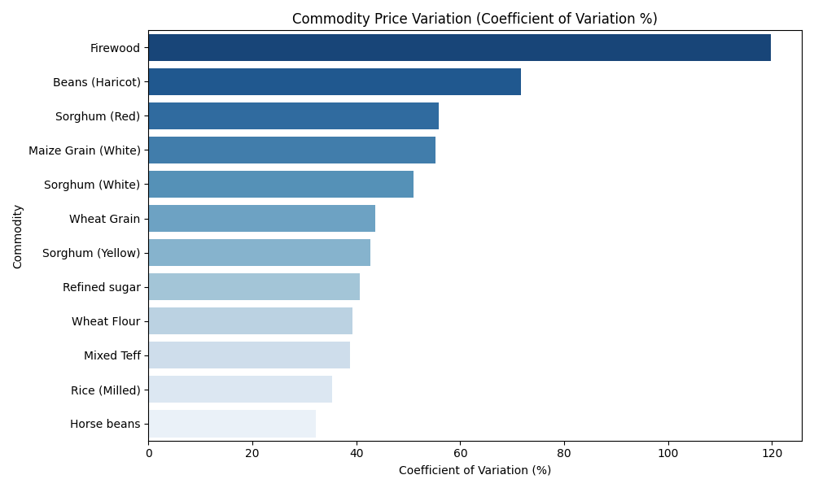
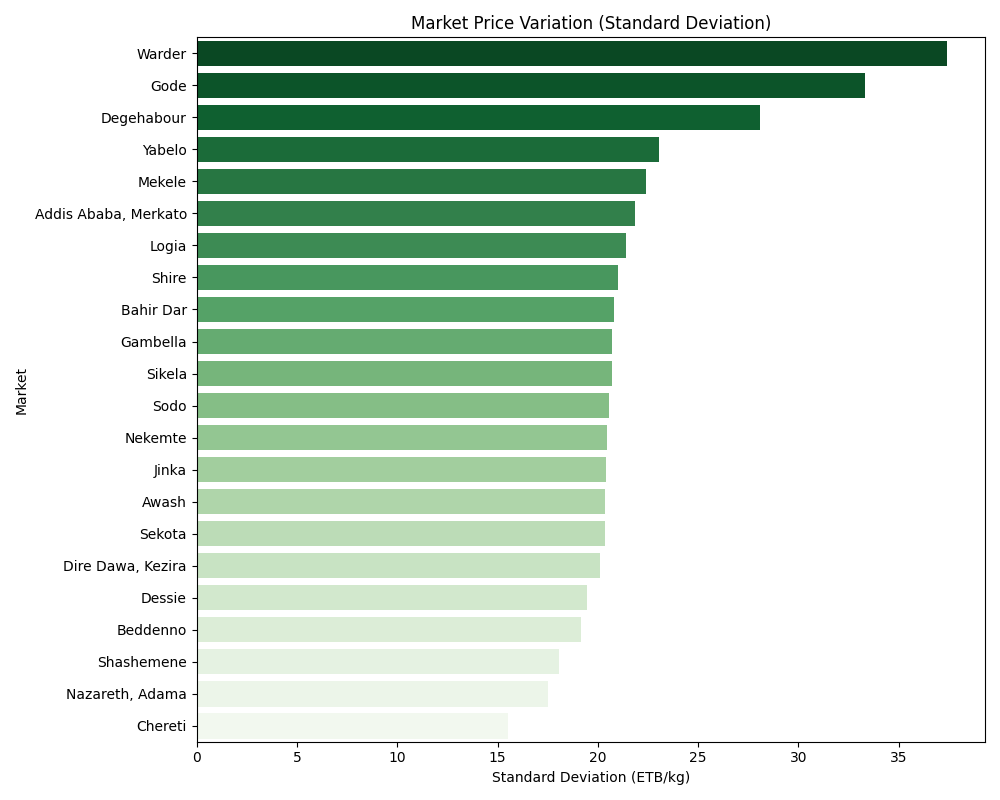

# Ethiopian Food Price Analysis

This project explores food price data across various markets and commodities in Ethiopia. The main goal is to understand how retail food prices vary depending on the commodity type and geographic location.

## Project Steps

The analysis is broken down into sequential Jupyter Notebooks:

1. **`01_data_exploration.ipynb`**: Initial exploration of the raw dataset.
2. **`02_data_cleaning.ipynb`**: Processing and filtering data to focus on retail, per-kg food prices in Ethiopian Birr (ETB).
3. **`03_commodity_analysis.ipynb`**: Exploring price differences across various food commodities.
4. **`04_location_analysis.ipynb`**: Comparing the average price of common commodities across different Ethiopian markets.
5. **`05_price_variation_analysis.ipynb`**: Investigating absolute (Standard Deviation) and relative (Coefficient of Variation) price fluctuations across markets and products.

## Dataset

The raw dataset (`data/raw/`) contains records with fields such as market location, date, product type, price, and currency. The cleaned dataset (`data/processed/clean_prices.csv`) is used for the core analysis.

## Key Visualizations

### Location & Market Analysis

**Average Price by Market**

*Figure 1: Displays the overall average retail food price (ETB/kg) across 22 Ethiopian markets. It highlights which markets tend to be generally more expensive (e.g., Warder) versus cheaper (e.g., Nekemte).*

**Commodity by Market Heatmap**

*Figure 2: A heatmap showing the average price (ETB/kg) of four widely available commodities across all tracked markets. Darker colors indicate higher prices.*

### Price Variation Analysis

**Commodity Price Variation (Standard Deviation)**

*Figure 3: Highlights the absolute price variation (in ETB/kg) across different commodities. Commodities with higher standard deviations experience wider price spreads.*

**Commodity Price Variation (Coefficient of Variation)**

*Figure 4: Shows the relative price variation (CV %) for different commodities. This reveals how much a commodity's price fluctuates relative to its own average price, with Firewood showing massive relative volatility.*

**Market Price Variation (Standard Deviation)**

*Figure 5: Compares how much prices fluctuate within each market. Warder shows the highest absolute price variation across the items sold there.*
